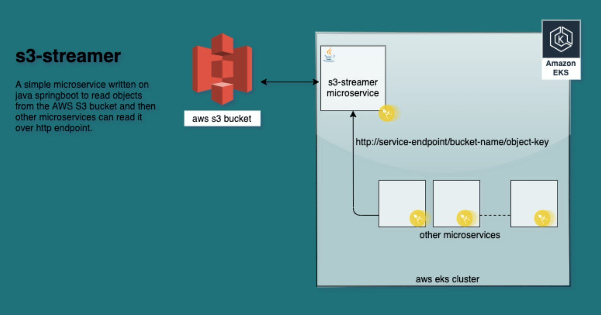

+++
title = "Streaming AWS S3 objects in AWS EKS cluster"
date = 2021-07-12T11:11:00+00:00

[taxonomies]
tags = ["technology"]

[extra]
author = "Dev Utkarsh"
+++

## Java spring-boot microservice to read objects from AWS S3 bucket that can be accessed by other microservices over HTTP



I recently came across a requirement to host static content for my microservices running on the AWS EKS cluster.

Since there were multiple services that will be accessing different objects so I thought to create a common S3 bucket for hosting and gave S3ReadAccess to my cluster.


> This saves effort on the microservices end. No S3 SDK implementation is required. So a microservice accessing any static content on the drive path locally just need to update its application config to point to an HTTP endpoint on deployment.

Also, this saves any need to adding persistent volume for static hosting on the cluster.

```bash
aws s3api create-bucket --bucket hosting-bucket --region us-east-1 --create-bucket-configuration LocationConstraint=us-east-1 
```

And then I wrote a common microservice named **s3Streamer** which can be used to read objects from the bucket over HTTP endpoint.
```bash
http://s3-streamer:9999/<bucket_name>/<object_key>
```

To deploy this, you can run a simple **kubectl** command
```bash
kubectl apply -f https://github.com/devutkarsh/s3-streamer/blob/master/s3-streamer.yaml
```

If you face any issues, you can take a look at [Github file.](https://github.com/devutkarsh/s3-streamer)