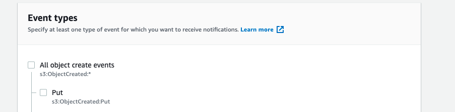
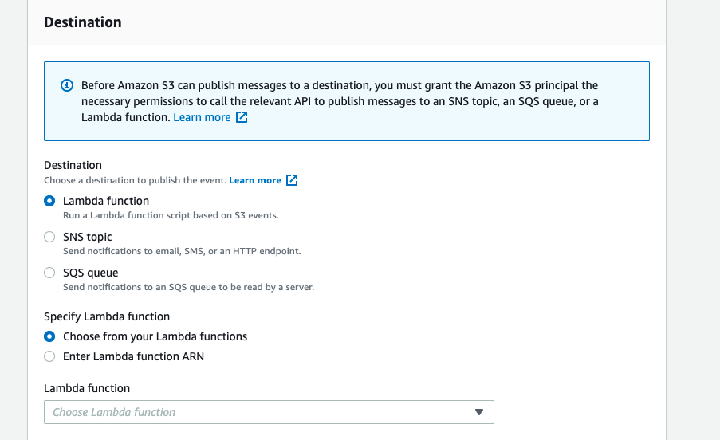

+++
title = "Using AWS S3 and Lambda to process file chunks"
date = 2021-06-20T11:11:00+00:00

[taxonomies]
tags = ["technology"]

[extra]
author = "Dev Utkarsh"
+++

## Merge file parts/chunks in S3 on receive - PUT object by invoking lambda


Sending files in chunks over the network is most common because it's easy to apply a retry mechanism over failed parts. On receiving all the parts then the parts or chunks are merged together to create one single file. We all know how frustrating is to see download failing at 99%.

Data chunking is the most common technique used by your wifi to send you data packets. Splitting the data into packets means the data transmission is not as dependent on the availability of the networks on the path. Once the packets are delivered, the sender sends a final confirmation. Say 200 OK!

In a common scenario where you receive files in multiple parts in your S3 Bucket instead of a large bulky file, you might need to merge those file parts in real-time.

The most effective way to do this using AWS S3 Events to invoke the AWS Lambda function to do the merge process over all the files.

You will need a valid S3 bucket, Lambda, and permissions around it as a Pre-requisite.

Your file coming in parts might be named as -
```
filename_part1.ext
filename_part2.ext
```
If any of your systems is generating those files, then use the system to generate a final dummy blank file name as -
```
filename.final
```

Since in your S3 event trigger you can use a suffix to generate an event, use .final extension to invoke lambda, and process records.


The event type in S3 should be PUT so that every time a file is PUT using PUT object operation with extension ***.final**



Since your event is set, then you need to invoke the target lambda which will receive the S3Event of the records that were put in the S3 bucket.



The S3 event structure looks like this - 
```json
{
  "Records": [
    {
      "eventVersion": "2.1",
      "eventSource": "aws:s3",
      "awsRegion": "us-east-2",
      "eventTime": "2019-09-03T19:37:27.192Z",
      "eventName": "ObjectCreated:Put",
      "userIdentity": {
        "principalId": "AWS:AIDAINPONIXQXHT3IKHL2"
      },
      "requestParameters": {
        "sourceIPAddress": "205.255.255.255"
      },
      "responseElements": {
        "x-amz-request-id": "D82B88E5F771F645",
        "x-amz-id-2": "vlR7PnpV2Ce81l0PRw6jlUpck7Jo5ZsQjryTjKlc5aLWGVHPZLj5NeC6qMa0emYBDXOo6QBU0Wo="
      },
      "s3": {
        "s3SchemaVersion": "1.0",
        "configurationId": "828aa6fc-f7b5-4305-8584-487c791949c1",
        "bucket": {
          "name": "lambda-artifacts-deafc19498e3f2df",
          "ownerIdentity": {
            "principalId": "A3I5XTEXAMAI3E"
          },
          "arn": "arn:aws:s3:::lambda-artifacts-deafc19498e3f2df"
        },
        "object": {
          "key": "b21b84d653bb07b05b1e6b33684dc11b",
          "size": 1305107,
          "eTag": "b21b84d653bb07b05b1e6b33684dc11b",
          "sequencer": "0C0F6F405D6ED209E1"
        }
      }
    }
  ]
}
```

Now further you need to implement the lambda code to process your records.
