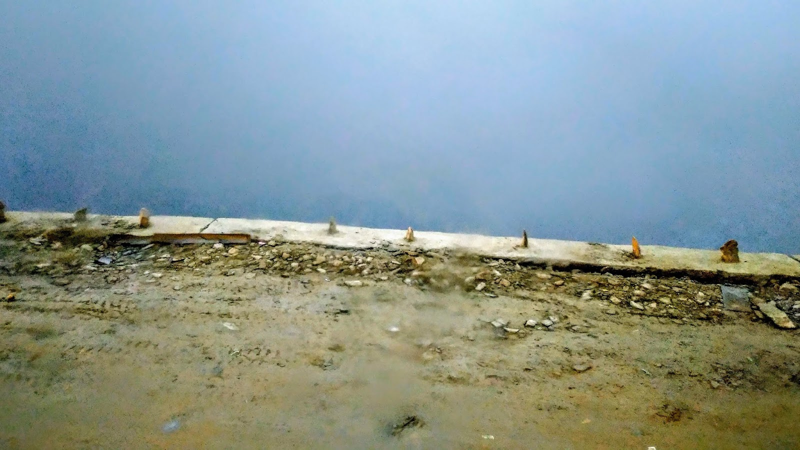
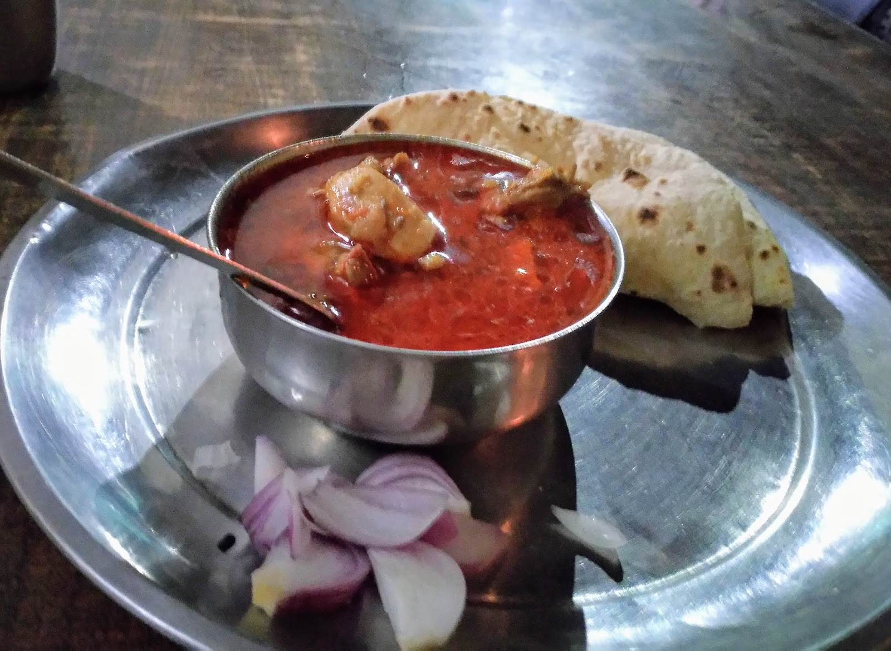
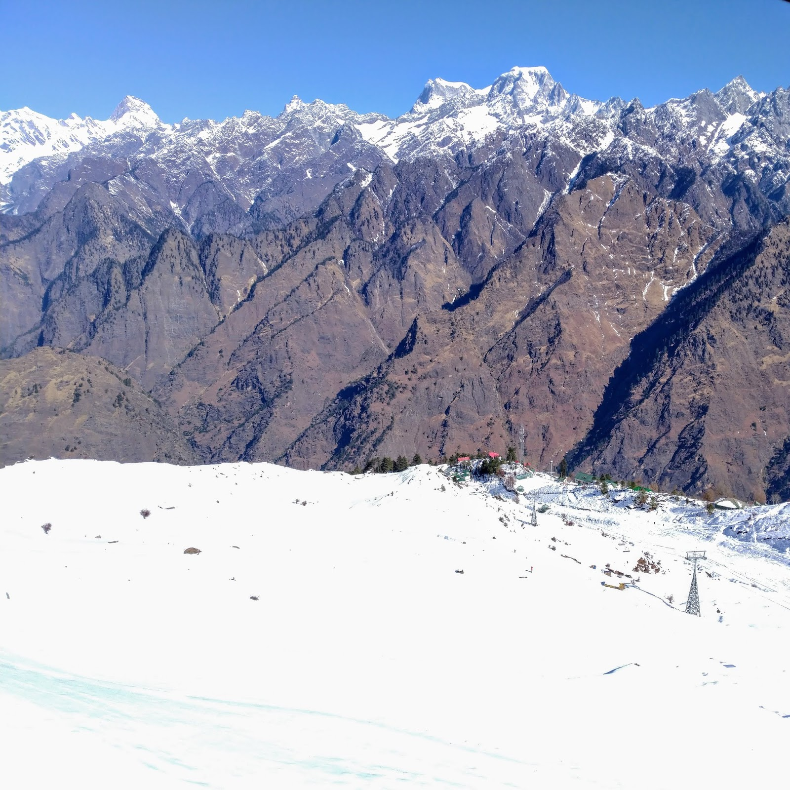

+++
title = "Auli & Joshimath - Snow & Skii India"
date = 2019-12-29T14:59:00.001+05:30

[taxonomies]
tags = ["travel"]

[extra]
author = "Dev Utkarsh"
+++

WELL, I KNOW NOW. I KNOW A LITTLE MORE HOW MUCH A SIMPLE THING LIKE A SNOWFALL CAN MEAN TO A PERSON. ~ SYLVIA PLATH
-------------------------------------------------------------------------------------------------------------------

Well, I started pretty early in the morning at 4am. I had not slept this night. This was a sudden plan and urge to visit Auli that I went to travel on. [Rishikesh](#) was already doing so good but I the wanderlust. It asked me to go more, see more, feel more and live a little more. So I boarded the government bus of Uttrakhand that passes from the Zostel.  
It was December and all foggy, the roads unclear along with the ongoing construction work being done to make better roads to Joshimath.  

  

Unknown Place on the way to Joshimath

  
It took me 12 hours to reach Joshimath while still most of the time not sleeping because I didn't wanted to miss the beautiful hills covered with snow. Kids walking to school and everything was just so nostalgic. My back was hurting but this was the only cheapest option to travel in budget I had. I reached Joshimath town surrounded by all the beautiful hills from all side. My original plan was to travel more from Joshimath to Raini village which was around 20 kms ahead to stay with my couchsurfing host Vivek Rana. It had snowed recently around the hills and so the villages and Joshimath town were facing electricity cut for a week now. I could not contact him and took a hotel with cheapest cost for 2 days. Today I needed rest and tomorrow I have to spent my day in Auli. Had dinner at a local shop and went to bed.  
  

Best Chicken at Dhaba opposite to Hotel Trishul, Joshimath

Next day I went to get the ticket to Auli Ropeway. You would not get the ticket it one go if you have not prebooked. It's not that easy. Its operated by government and now you can understand how it works. So after a lot of pleading to different officials I got a ticket. The ropeway journey made it more amazing. On reaching the top of Auli with all snow all around. I was trying to make balance on such tough landscape. I tried skiing for 3 hours. Gopi, my skiing guide became my friend, and told all the great stories. Fell down for around 20 times while skiing, he picked me up every time. Such great people. Also, the place had a beautiful view. It cleared out my head.  

View from Auli

After having an amazing day, I went back to Joshimath. I realized later in the night how much body pain was there because of the thrilling day, but I smiled. I shivered while wearing my jacket and having the quilt on. It was -9 degree in Joshimath today. But I smiled. And you may ask why? I was thrilled. I was happy. I was on my own. I was my tour guide and I was my guardian. And obviously I was creating the beautiful memories I can later tell stories of, before I get too old. I was living.  
  
The next morning again at 4am I took the bus and reached back to [Rishikesh](#). Then next day to Bareilly and then to [Lucknow](../lucknow-uttar-pradesh-city-of-nawabs), my hometown to see my parents.  
  