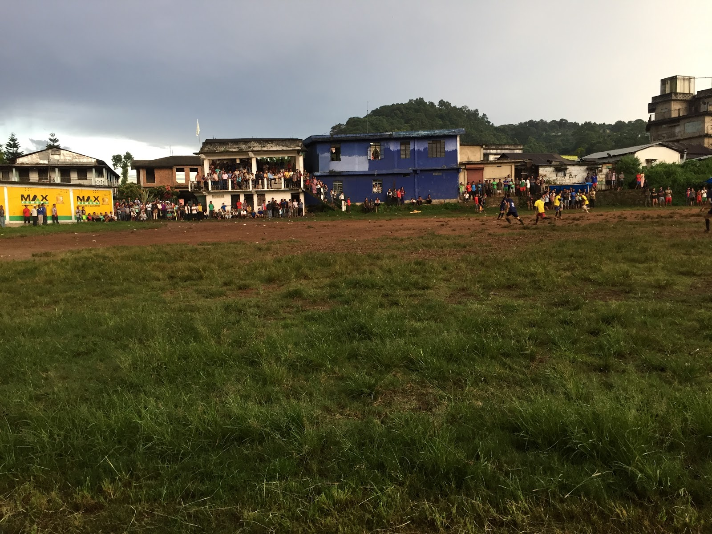

+++
title = "Shillong - Rock Capital of India"
date = 2017-10-09T17:23:00.000+05:30

[taxonomies]
tags = ["travel"]

[extra]
author = "Dev Utkarsh"
+++

I THINK THAT'S WHAT IT IS WITH ROCK MUSIC. IT HELPS YOU HANG TOUGH, I GUESS. ~ ANGUS YOUNG
------------------------------------------------------------------------------------------

Malki Grounds, Shillong

What a beautiful drive to Shillong from Guwahati, it took around 3 hours to cover the 100 km stretch. It was drizzling when I started, got a little drenched as well. While I reached the city, I saw an amazing evening with an ongoing football match at Malki Grounds, meanwhile the sun was setting down. Then I went to my stay and met some amazing Graphic Designers from Shillong, and had a good time in rock city.  
  
Next day I went to explore some of Shillong and visited one of the beautiful Shillong peak and Elephant falls. Shillong peak is a small hill that gives you all the overview of the city.  
Also, Elephant falls were wide and massive though it depends at what time of season you visit the falls.  
  
On my way back I visited Police Bazaar to explore local cuisines and shops. There I found a shop serving tasty and hot Momos with Chicken soup. This was the first time I learned that Momos are meant to be served with Soup. That's how they do it in North-East India.  
  
My original plan was to visit the NH7 weekender in Shillong too, but unfortunately the events date got shifted and I was here is Shillong thinking where to go next. See, that is the beauty of traveling, the unplanned events will happen, no matter what or how efficiently you plan it. Some plans will not fall in place and will come out as an adventure for you.  
  
After spending almost one and half amazing days in Shillong, I started for [Cherrapunji](../cherrapunji-or-sohra-october-drizzles). Please visit the links to read further about my experiences from [Cherrapunji](../cherrapunji-or-sohra-october-drizzles) or [Sohra](../cherrapunji-or-sohra-october-drizzles). The famous town for all the year rains.  
  
Also, here is a link to a song which that helped me writing this post.  
[Glycerine by Bush.](https://www.youtube.com/watch?v=hOllF3TgAsM)